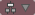
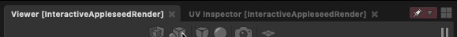
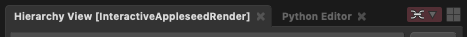

# Tutorial: Assembling the Gaffer Bot #

In this tutorial, we will give you a first taste of Gaffer by covering its basic operations and concepts. The goal is for you to learn to make renders of a basic scene as quickly as possible, and provide a minimal basis to further explore the application and its documentation. It will cover a lot of ground quickly, and some details will be glossed over.

By the end of this tutorial you will have built a basic scene with Gaffer's robot mascot, Gaffy, and render an output image. You will learn the following lessons, not necessarily in this order:

- Gaffer UI fundamentals
- Creating and connecting nodes
- Importing geometry
- Constructing a basic scene hierarchy
- Importing textures
- Building a simple shader
- Applying a shader to geometry
- Adding a light
- Using an interactive renderer

> Note :
> This tutorial uses Appleseed, a free renderer included with Gaffer. While the Appleseed-specific nodes described here can be substituted with equivalents from Arnold or 3Delight, we recommend that you complete this tutorial using Appleseed before moving on to your preferred renderer.

## Starting a new node graph ##

After [installing Gaffer](../../GettingStarted/InstallingGaffer/index.md), launch Gaffer [from its directory](../../GettingStarted/LaunchingGafferFirstTime/index.md) or by using the ["gaffer" command](../../GettingStarted/SettingUpGafferCommand/index.md). Gaffer will start, and you will be presented with an empty node graph in the default UI layout.

## Importing a geometry scene cache ##

As Gaffer is a tool primarily designed for lookdev, lighting, and VFX process automation, we expect that your sequence's modelling and animation will be created in an external tool like Maya, and then imported into Gaffer as a geometry/animation cache. Gaffer supports Alembic (.abc) and USD (.usdc and .usda) file formats, as well as its own native SceneCache (.scc) file format. Most scenes begin by importing geometry or images via one of the two types of Reader nodes: [SceneReader](../../Reference/NodeReference/GafferScene/SceneReader.md) or [ImageReader](../../Reference/NodeReference/GafferImage/ImageReader.md).

First, load Gaffy's geometry cache with a SceneReader node:

1. In the Graph Editor in the bottom-left panel, right-click. The node creation menu will appear.

2. Select _Scene_ > _File_ > _Reader_. The SceneReader node will appear in the Graph Editor and be selected automatically.

     <!-- TODO: add annotation? -->

3. The Node Editor in the top-right panel has now updated to display the SceneReader node's values. In the _File Name_ field, type `${GAFFER_ROOT}/resources/gafferBot/caches/gafferBot.scc`.

4. Hover the cursor over the background of the Viewer (in the top-left panel), and hit <kbd>F</kbd>. The view will reframe to cover the whole scene.

     <!-- TODO: add annotation -->

The SceneReader node has loaded, and the Viewer is showing a bounding box, but the geometry remains invisible. You can confirm that the scene has loaded by examining the Hierarchy View in the bottom-right panel. It too has updated, and shows that you have `GAFFERBOT` at the root of the scene. In order to view the geometry, you will need to expand the scene's locations down to their leaves.

> Important :
> By default, the Viewer, Node Editor, and Hierarchy View update to reflect the last selected node, and go blank when no node is selected.

## The scene hierarchy ##

When you load a geometry cache, Gaffer only reads its 3D data: at no point does it write to the file. This lets you manipulate the scene without risk to the file.

> Important :
> 3D data in Gaffer can be non-destructively hidden, added to, changed, and deleted.

Further, Gaffer uses locations in the scene hierarchy to selectively render the objects (geometry, cameras) you need: in the Viewer, the objects of expanded locations will show, while the objects of collapsed locations will only appear as a bounding box. This on-demand object loading allows Gaffer to handle highly complex scenes. In your current node graph, only Gaffy's bounding box is visible in the Viewer.

> Important :
> Only objects that have their parent locations expanded will appear in full in the Viewer. Objects with collapsed parent locations will appear as a bounding box.

### Navigating the scene using the Hierarchy View ###

Until you expand Gaffy's scene's locations, all geometry will remain a bounding box.

You can use the Hierarchy View to expand the scene's locations:

1. If the SceneReader node is deselected, select it by clicking it in the Graph Editor.

2. In the Hierarchy View, click  next to `GAFFERBOT`. The `GAFFERBOT` location will expand to show a child location named `C_torso_GRP`.

3. Click  next to `C_torso_GRP` to show its child locations.

     <!-- TODO: add annotation -->

> Note :
> Gaffy's geometry cache contains location names with affixes like "C", "R", "L", "GRP", "CPT" and "REN". Gaffer places no significance whatsoever on these names, and you are free to use whichever naming conventions you see fit.

In the Viewer, you can now see the bounding boxes of the objects at several locations, revealing more of the scene's structure. However, it would be tedious to expand the whole scene, location-by-location, in this manner. Instead, you can expand a location, its children, and all its sub-children at once with a shortcut:

1. In the Hierarchy View, <kbd>Shift</kbd> + click the  next to `C_head_GRP`. All of the children of `C_head_GRP` will expand. Now the Viewer shows all of the geometry that comprises Gaffy's head.

2. <kbd>Shift</kbd> + click the  next to `R_legUpper_GRP`. All the locations under `R_legUpper_GRP` will expand. Now the Viewer also shows all of the geometry that comprises Gaffy's right leg.

### Navigating the scene using the Viewer ###

As you explored the scene using the Hierarchy View, the Viewer updated to show the geometry you expanded. The Viewer also permits scene navigation through direct interaction with the geometry and bounding boxes in its viewport. This provides a more intuitive method for scene traversal, which can be invaluable when handling very complex scenes.

You can expand the scene hierarchy using the arrow keys and the Viewer:

1. In the Viewer, click-drag and release a marquee over the bounding box for Gaffy's left leg.

2. Hit <kbd>↓</kbd> to expand the selection down one level. The highlighted bounding box will be replaced by two smaller bounding boxes, indicating that you have expanded the location's children.

3. Hit <kbd>Shift</kbd> + <kbd>↓</kbd> to fully expand all the left leg's child locations.

    

You can also collapse locations in a similar manner through the Viewer:

1. With the geometry of the left leg still selected, hover the mouse inside the Viewer.

2. Hit <kbd>↑</kbd>. The geometry will collapse into its bounding boxes.

3. Keep hitting <kbd>↑</kbd> until all of Gaffy's geometry is collapsed back into the root bounding box.

You may have noticed that when you expanded and collapsed parts of the scene using the Viewer, the locations and geometry were also highlighted and selected in the Hierarchy View.

> Important :
> Selecting, expanding, and collapsing scene locations through the Hierarchy View and the Viewer are one and the same.

## Adjusting the view in the Viewer ##

Like in other 3D tools, you can adjust the angle, field of view, and the position of the virtual camera in the Viewer.

- To rotate/tumble, <kbd>Alt</kbd> + click and drag.
- To zoom/dolly in and out, <kbd>Alt</kbd> + right click and drag, or scroll the middle mouse.
- To track from side to side, <kbd>Alt</kbd> + middle click and drag.

> Tip :
> If you lose sight of the scene and cannot find your place again, you can always refocus on the currently selected location by hovering the cursor over the Viewer and hitting <kbd>F</kbd>.

## Creating a camera ##

Before you can begin rendering the scene, you will need to create a camera. Just like how you created a SceneReader node to load in the geometry, you will create another node to add a camera.

Earlier, you learned how to create a node by navigating the node creation menu in the Graph Editor. If you know the name of the node you wish to create, and do not feel like mousing through the menu, you can instead use the menu's search feature:

1. Right-click the background of the Graph Editor. The node creation menu will open.

    > Tip :
    > With the cursor hovering over the Graph Editor, you can also hit <kbd>Tab</kbd> to open the node creation menu.

2. Type `camera`. A list of search results will appear. _Camera_ should be highlighted.

3. Hit <kbd>Enter</kbd>. A Camera node will appear in the Graph Editor.

    

As before, the newly created node will be selected automatically, and the Viewer, Hierarchy View, and Node Editor will update to reflect this new selection.

## Node data flow ##

So far, your graph is as such: the SceneReader node is outputting a scene with Gaffy's geometry, and the Camera node is outputting a camera object. In fact, the Camera node is outputting a **whole scene** containing a camera object. As such, any node that sends or receives scene data is classified as a **scene node**. This paradigm may be a bit confusing compared to other DCCs, but it is one of Gaffer's strengths.

> Important :
> When a scene node is queried, such as when you select it, it will dynamically compute a scene based on the input values and data it is provided.

### Scenes ###

In Gaffer, there is no single data set of locations and properties that comprise the sequence's scene. In fact, a Gaffer graph is not limited to a single scene. Instead, when a node is queried, a scene is dynamically computed as that node's output. You can test this by clicking the background of the Graph Editor. With no node selected, the Hierarchy View goes blank, because there is no longer a scene requiring computation. Thus, no scene exists. Since scenes are computed only when needed, Gaffer has the flexibility to support an arbitrary quantity of them.

Since neither of your nodes is connected, each of their scenes remains separate. If you were to evaluate your graph right now, it would calculate two independent scenes. For them to interface, they must be joined somewhere later in the graph.

> Important :
> In the Graph Editor, node data flows from top to bottom.

When a scene node computes a scene, scene data passes through it like so:

1. Data flows into the node through its input(s).

2. If applicable, the node modifies the data.

3. The node computes the resulting scene data and sends it through its output.

### Plugs ###

The inputs and outputs of a node are called **plugs**, and are represented in the Graph Editor as colored circles around the node's edges.

<!-- TODO: add close-up of node plugs  -->

For your two nodes to occupy the same scene (and later render together), you will need to combine them into a single scene. You can connect both of their out plugs to a Group node, and you can also rearrange the nodes to better visually represent the data flow in the graph.

## Connecting plugs ##

It's time to connect the SceneReader and Camera nodes to combine their scenes:

1. Click the background of the Graph Editor to deselect all nodes.

2. Create a Group node (_Scene_ > _Hierarchy_ > _Group_).

3. Click and drag the SceneReader node's out plug (at the bottom; blue) onto the Group node's in0 plug (at the top; also blue). As you drag, a node connector will appear. Once you connect them, a second input plug (in1) will appear on the Group node, next to the first.

4. Click and drag the Camera node's out plug onto the Group node's in1 plug.

The Group node is now computing a new scene combining the input scenes from the two nodes above it, under a new parent scene location called `group`. You can see this new hierarchy by selecting the Group node and examining the Hierarchy View.

Only the combined scene computed by the Group node is modified. The upstream nodes' scenes are unaffected. You can verify this by reselecting one of them and checking the Hierarchy View.

## Navigating the Graph Editor ##

You may have noticed that you can intuitively click and drag the nodes around in the Graph Editor. You can also pan around and zoom:

- To pan, <kbd>Alt</kbd> + click and drag, or middle-click and drag.
- To zoom in and out, <kbd>Alt</kbd> + right-click and drag, or scroll the middle mouse.
- To focus on the currently selected node, hover the cursor over the Graph Editor and hit <kbd>F</kbd>.

## Positioning the camera ##

Next, you should reposition the camera so that it frames Gaffy. You can accomplish this using the built-in 3D manipulation tools in the Viewer.

First, set the camera's position using the Translate Tool:

1. Select the Group node in the Graph Editor.

2. Fully expand all scene locations by <kbd>Shift</kbd> + clicking  next to `group` in the Hierarchy View.

3. Click the camera object in the Viewer, or select the `camera` location in the Hierarchy View.

4. In the Viewer, click . The translation manipulators will appear on the camera.

5. Using the manipulators, adjust the camera back and up.

    

Next, rotate the camera using the Rotate Tool:

1. In the Viewer, click . The rotation manipulators will appear around the camera.

2. Using the manipulators, rotate the camera so it points at Gaffy.

### More precise camera adjustment ###

For more precise positioning and rotation, you can set the Translate and Rotate values in the _Transform_ tab of the Node Editor:

> Important :
> In the prior section _Connecting Plugs_, we referred to the main inputs and outputs of a node as plugs. In actuality, **all** the values you see in the Node Editor, including the camera's transform, are plugs. For ease of use, only a subset of a node's available plugs appear in the Graph Editor.

## Rendering your first image ##

Now that you have defined the layout of your scene, you should perform a quick test-render to check that everything is working as expected. In order to do that, you need to place some render-related nodes to define your graph's render settings.

Create the render settings nodes:

1. First, select the Group node. Now, the next scene node you create will automatically connect to it.

2. Then, create the following nodes in sequence:
    - StandardOptions (_Scene_ > _Globals_ > _StandardOptions_): Determines the camera, resolution, and blur settings of the scene.
    - AppleseedOptions (_Appleseed_ > _Options_): Determines the settings of the Appleseed renderer.
    - Outputs (_Scene_ > _Globals_ > _Outputs_): Determines what kind of output image will be created by the renderer.
    - InteractiveAppleseedRender (_Appleseed_ > _InteractiveRender_): An instance of Appleseed's progressive renderer.

3. Finally, create a Catalogue node (_Image_ > _Utility_ > _Catalogue_). This is an image node for listing and displaying a directory of images in the Viewer. By default, it points to the default output directory of your graph's rendered images. Place it next to the InteractiveAppleseedRender node.

    

    > Note :
    > The Catalogue node is not a scene node, but an image node. It cannot be connected to a scene node.

In keeping with what we said earlier about nodes passing scenes to other nodes: each of the render nodes only applies to the scene delivered to it through its input plugs. If you had another unconnected scene running in parallel, none of these render properties would apply to it.

Although the scene contains a camera, you will need to tell the StandardOptions node to set it as a global property of the scene:

1. Select the StandardOptions node.

2. Specify the camera using the Node Editor:
    1. Click the _Camera_ section to expand it.
    2. Toggle the switch next to the Camera plug to enable it.
    3. Type `/group/camera` into the plug's field.

Next, you need to add an image type to render:

1. Select the Outputs node.

2. In the Node Editor, click  and select _Interactive_ > _Beauty_ from the drop-down menu.

With all the settings complete, start the interactive renderer:

1. Select the InteractiveAppleseedRender node in the Graph Editor.

2. In the Node Editor, click  to start the renderer.

3. Select the Catalogue node.

4. Hover the cursor over the Viewer and hit <kbd>F</kbd> to frame the Catalogue node's live image of the interactive render.

    

Congratulations! You have successfully rendered your first image. Gaffy is currently lacking shading, lighting, and texturing. We will move on to those soon. First, you should adjust the UI to provide yourself a more optimal workflow.

## Pinning an editor to a node ##

As mentioned earlier, the Viewer, Hierarchy View, and Node Editor (each an **editor**) show their respective outputs of the currently selected node. This is not always convenient, because often you will need to edit one node while viewing the output of another. You can solve this by **pinning** an editor while a node is selected, which keeps that editor focused on the node.

To make switching between viewing Gaffy's geometry and the render easier, you can modify the UI so you can work with two Viewers. First, start by pinning the last node in the graph that contains the scene:

1. Select the InteractiveAppleseedRender node.

2. From the editor focus menu  at the top-right of the top panel, choose _Node Selection_ in the _Pin_ group. The menu's icon will change to the pinned icon () to show it is now locked to a specific node, and the Viewer's title in the tab bar will now include _[InteractiveAppleseedRender]_ to help you keep track of which node(s) are pinned in which editors.

> Tip :
> You can also pin an editor to the current node selection by pressing <kbd>P</kbd> whilst the cursor is over the editor.

The Viewer is now locked to the InteractiveAppleseedRender node's scene (which contains all of the parts from its upstream scenes), and will only show that scene, even if you deselect it or select a different node.

In the default layout, the Hierarchy View and other editors are set to follow the Viewer. You can tell which editors are linked in this way by the color of their editor focus mode menu. Slave editors will also show the slave icon () in their editor focus menu.

For the final adjustment to the UI, create another Viewer in the top-left panel, and pin the Catalogue node to it. This time we'll use another pinning shortcut:

1. At the top-right of the top panel, click  to open the layout menu.

2. Select Viewer. A new Viewer will appear on the panel next to the first one.

3. Middle-click and drag the Catalogue node onto the new Viewer. That Viewer is now pinned to that node.

<!-- TODO: Screenshot of the pinned Viewer -->

Now you can switch between the scene's geometry (first Viewer) and the rendered image (second Viewer).

Now it is time to shade Gaffy.

## Adding shaders and lighting ##

It's time to add shaders and lighting. Lights are created at their own location, and can be added anywhere in the graph. For efficiency, shaders should be added to the geometry as early as possible.

### Making some space ###

It will be best if you keep the render option nodes at the end of the graph. Since you will be adding shader nodes after the scene nodes, first add some space in the middle of the graph:

1. Select the lower five nodes by clicking and dragging a marquee over them.

2. Click and drag the nodes to move thme to a lower position in the graph.

    

### Adding a shader ###

Now that you have more space, it's time to add some shading nodes:

1. Below and to the left of the Group node, create an Appleseed closure-to-surface node (_Appleseed_ > _Shader_ > _Surface_ > _asClosure2Surface_).

2. Create an Appleseed Disney material shader node (_Appleseed_ > _Shader_ > _Shader_ > _asDisneyMaterial_).

3. In the Node Editor, give the shader reflective surface properties:
    - Set the Specular Weight plug to `0.6`.
    - Set the Surface Roughness plug to `0.35`.

4. Connect the out_outColor plug of the as_disney_material node to the input plug of the as_closure2surface node.

5. Select the as_closure2surface node and create a ShaderAssignment node (_Scene_ > _Attributes_ > _ShaderAssignment_).

6. Click and drag the ShaderAssignment node onto the connector between the Group and StandardOptions nodes. The ShaderAssignment node will be interjected between them.

    

> Important :
> In the Graph Editor, shader data flows from left to right.

In your newly shaded graph, the ShaderAssignment node takes the shader flowing in from the left and assigns it to Gaffy's scene flowing in from the top. Now that Gaffy has received a proper shader, the whole image has turned black, because the scene currently lacks lighting.

### Adding an environment light ###

For lights to take effect, they need to be combined with the main scene. For simplicity, use a global environment light:

1. Create an Appleseed physical sky modelling node (_Appleseed_ > _Environment_ > _PhysicalSky_).

2. Place it next to the Camera node in the Graph Editor.

3. In the Node Editor, adjust the node's angle and brightness plugs:
    - Set the Sun Phi Angle plug to `100`.
    - Set the Luminance plug to `2.5`.

4. Connect the node's out plug to the Group node's in3 plug.

For the light to take effect, you will need to assign it:

1. Select the AppleseedOptions node.

2. In the Node Editor, expand the _Environment_ section.

3. Toggle the switch next to the Environment Light plug to enable it.

4. Type `/group/light` into the plug's field.

The interactive render will now begin updating, and you will be able to see Gaffy with some basic shaders and lighting.

### Adding textures ###

As Gaffy is looking a bit bland, you should drive the shader with some robot textures:

1. Create an Appleseed 2D texture node (_Appleseed_ > _Shader_ > _Texture2d_ > _asTexture_).

2. In the Node Editor, point the node to the textures:
    - For the Filename plug, type `${GAFFER_ROOT}/resources/gafferBot/textures/base_COL/base_COL_<UDIM>.tx`.

3. In the Graph Editor, connect the as_texture node's Output Color plug to the as_disney_material node's Common.Surface Color plug. Gaffy's textures will now drive the color of the surface shader, and the render will update to show the combined results.

    

### Adding another shader ###

Right now, the physical surface of all of Gaffy's geometry looks the same, because the shader is applying to every component of the geometry. To fix this, you should create an additional metallic shader and apply it selectively to different locations.

Begin by creating another shader:

1. Create and connect another pair of as_disney_material and as_closure2surface nodes.

2. Give the shader some metallic properties:
    - Set Metallicness to `0.8`.
    - Set Surface Roughness to `0.4`.

3. Select the as_closure2surface1 node and create another ShaderAssignment node.

4. Interject the new ShaderAssignment1 node after the first ShaderAssignment node.

    

The Viewer will update to show the new shader.

You will immediately notice that now **all** the geometry is metallic. The new shader has overridden the previous one.

> Important :
> The last ShaderAssignment node applied to a location takes precedence over any others.

### Filtering a shader ###

In order to selectively apply a shader to only certain locations in the scene, you will need to filter the shader assignment, using a filter node that points to specific locations in the scene:

1. Create a PathFilter node (_Scene_ > _Filters_ > _PathFilter_).

2. In the Node Editor, click  next to _Paths_. This will add a new text field.

3. In the text field, type `/group/GAFFERBOT/C_torso_GRP/C_head_GRP/C_head_CPT/L_ear001_REN`. This is the full path to Gaffy's left ear.

4. Connect the PathFilter node's out plug to the ShaderAssignment1 node's filter plug (yellow, on the right).

    

Now when you check the render, you will see that the chrome shader is only applied to Gaffy's left ear. There are many other parts of Gaffy that could use the chrome treatment, but it would be tedious for you to manually enter multiple locations. Instead, we will demonstrate two easier ways to add locations to the filter: using text wildcards, and interacting directly with the geometry through the Viewer.

#### Filtering using wildcards ####

Earlier, you used `/group/GAFFERBOT/C_torso_GRP/C_head_GRP/C_head_CPT/L_ear001_REN`, which only pointed to the left ear. You could apply the filter to both ears by adding wildcards to the `/L_ear001_REN` location in the path:

1. Select the PathFilter node.

2. In the Node Editor, double-click the path field you created earlier, and change it to `/group/GAFFERBOT/C_torso_GRP/C_head_GRP/C_head_CPT/*_ear*`. The filter will now match the left and the right ears.

#### Filtering by dragging selections ####

As your final lesson in this tutorial, add the metallic shader to the rest of the appropriate parts of Gaffy. This time, you can add to the filter by directly interacting with the scene:

1. In the top panel, switch to the Viewer containing the 3D geometry view.

2. Zoom and pan to Gaffy's face.

3. Click Gaffy's unibrow.

4. <kbd>Shift</kbd> + click Gaffy's mouth to add it to the selection.

    

5. Click and drag the selection (the cursor will change to ), and hold it over the PathFilter node without releasing.

6. While still holding the mouse button, hold <kbd>Shift</kbd> (the cursor will change to ). You are now adding to the path, rather than replacing it.

7. Release the selection over the PathFilter node. This will add the locations as new values fields on the plug.

> Tip :
> Just as locations can be added by holding <kbd>Shift</kbd>, they can be removed by holding <kbd>Ctrl</kbd> (the cursor will change to ).

Add and remove locations to the filter as you see fit. Remember to switch between the two Viewers to check the render output as it updates. After adding Gaffy's hands and bolts to the filter, you should achieve an image similar to this:

## Recap ##

Congratulations! You've built and rendered your first scene in Gaffer.

You should now have a basic understanding of Gaffer's interface, the flow of data in a graph, how to manipulate the scene, and how to add geometry, lights, textures, and shaders.

You should now have a solid basis for further learning and exploration.

## See also ##

- [Installing Gaffer](../InstallingGaffer/index.md)
- [Controls and Shorcuts](../../Interface/ControlsAndShortcuts/index.md)
