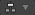

---
substitutions :
  leftClick : ""
  rightClick : ""
  middleClick : ""
  mouseWheel : ""
  editorFocusMenu : ""
  activeRenderPass : ""
---

# Controls and Shortcuts #

The following is a list of input device controls and shortcuts providing quick access to functionality in Gaffer's Viewers and Editors.

## Guide ##

### Keyboard Shortcuts ###

Keyboard shortcuts, or hotkeys, are shown as they would typically appear on a keyboard:

Example Action                       | Shortcut
-------------------------------------|--------------------
Type the letter `g`                  | {kbd}`G`
Press a modifier key                 | {kbd}`Ctrl`
Press multiple keys together         | {kbd}`Ctrl` + {kbd}`C`
Press one of the following keys      | {kbd}`A`, {kbd}`B`, {kbd}`C`, {kbd}`D`
Press either of the following keys   | {kbd}`Enter` or {kbd}`Return`

> Tip :
> macOS users: replace <kbd>Ctrl</kbd> with <kbd>Command ⌘</kbd>.

### Mouse Controls ###

Mouse controls are shown as icons representing the action to perform:

Example Action                       | Mouse control
-------------------------------------|--------------------
Press the left mouse button          | {{leftClick}}
Press the middle mouse button        | {{middleClick}}
Press the right mouse button         | {{rightClick}}
Scroll the mouse wheel               | {{mouseWheel}}

## General ##

Action                               | Control or shortcut
-------------------------------------|--------------------
New node graph                       | {kbd}`Ctrl` + {kbd}`N`
Open node graph                      | {kbd}`Ctrl` + {kbd}`O`
Save node graph                      | {kbd}`Ctrl` + {kbd}`S`
Save node graph as                   | {kbd}`Ctrl` + {kbd}`Shift` + {kbd}`S`
Quit the application                 | {kbd}`Ctrl` + {kbd}`Q`
Undo                                 | {kbd}`Ctrl` + {kbd}`Z`
Redo                                 | {kbd}`Ctrl` + {kbd}`Shift` + {kbd}`Z`
Step one frame forward               | {kbd}`→`
Step one frame backward              | {kbd}`←`
Play forward                         | {kbd}`Ctrl` + {kbd}`→`
Play backward                        | {kbd}`Ctrl` + {kbd}`←`
Stop playback                        | {kbd}`→`, {kbd}`←`, {kbd}`Ctrl` + {kbd}`→`, {kbd}`Ctrl` + {kbd}`←`
Fullscreen mode                      | {kbd}`F11`
Hide tabs of current panel           | {kbd}`Ctrl` + {kbd}`T`
Maximise current panel               | {kbd}`Space`

> Note :
> Gaffer has many interactions requiring drag and drop of UI elements. As an alternative to holding {{leftClick}} for the duration of a drag, {kbd}`G` can be pressed once to start a drag and then once again to complete the drag.

Action                               | Control or shortcut
-------------------------------------|--------------------
Begin a {{leftClick}} drag           | Hover cursor over drag target, {kbd}`G`
Complete a {{leftClick}} drag        | While dragging, hover cursor over drop target, {kbd}`G`

### Pinnable Editors and Inspectors ###

Action                               | Control or shortcut
-------------------------------------|--------------------
Follow the focus node                | Hover cursor over editor, <kbd>&#96;</kbd>
Pin the node selection               | Hover cursor over editor, {kbd}`P`
Pin numeric bookmark 1-9             | Hover cursor over editor, {kbd}`1` - {kbd}`9`
Follow to the node selection         | Hover cursor over editor, {kbd}`N`

## Graph Editor ##

> Note :
> For the following controls and shortcuts, the cursor must hover over the Graph Editor.

### Navigation ###

Action                               | Control or shortcut
-------------------------------------|---------------------------------------------
Pan                                  | {kbd}`Alt` + {{leftClick}} and drag
Zoom                                 | {kbd}`Alt` + {{rightClick}} and drag or {{mouseWheel}}
Pan/Zoom, fine precision             | Hold {kbd}`Shift` during action
Frame selected nodes                 | {kbd}`F`
Enter `Box` node (subgraph)          | {kbd}`↓`
Leave `Box` node (subgraph)          | {kbd}`↑`
Search for nodes                     | {kbd}`Ctrl` + {kbd}`F`
Frame to numeric bookmark            | {kbd}`1` … {kbd}`9`
Frame to focus node                  | <kbd>&#96;</kbd>

### Node creation ###

Action                              | Control or shortcut
------------------------------------|--------------------
Show node menu                      |  {{rightClick}} or {kbd}`Tab`
Insert `Dot` at connection          |  {kbd}`Ctrl` + {{leftClick}} connection or {{rightClick}} connection > *Insert Dot*

### Node selection ###

Action                               | Control or shortcut
-------------------------------------|-------------------
Select all                           | {kbd}`Ctrl` + {kbd}`A`
Clear selection                      | {kbd}`Ctrl` + {kbd}`Shift` + {kbd}`A`
Select node                          | {{leftClick}}
Add node to selection                | {kbd}`Shift` + {{leftClick}}
Add/remove node from selection       | {kbd}`Ctrl` + {{leftClick}}
Select nodes                         | {{leftClick}} and drag marquee, then release
Add nodes                            | {kbd}`Shift` + {{leftClick}} and drag marquee, then release
Deselect nodes                       | {kbd}`Ctrl` + {{leftClick}} and drag marquee, then release
Select upstream nodes                | {kbd}`Shift` + {kbd}`Alt` + {{leftClick}} node
Select downstream nodes              | {kbd}`Ctrl` + {kbd}`Alt` + {{leftClick}} node

### Node dispatch ###

> Note :
> For these dispatch-related shortcuts, the cursor does **not** need to hover over the Graph Editor.

Action                               | Control or shortcut
-------------------------------------|-------------------
Dispatch selected node(s)            | {kbd}`Ctrl` + {kbd}`E`
Redo last dispatch                   | {kbd}`Ctrl` + {kbd}`R`

### Node copying and deletion ###

> Tip :
> For a Box node to be disableable, it must first be [set up for pass-through](../../WorkingWithTheNodeGraph/BoxNode/index.html#setting-up-a-box-for-pass-through).

Action                               | Control or shortcut
-------------------------------------|--------------------
Cut node(s)                          | {kbd}`Ctrl` + {kbd}`X`
Copy node(s)                         | {kbd}`Ctrl` + {kbd}`C`
Paste node(s)                        | {kbd}`Ctrl` + {kbd}`V`
Duplicate node(s) with inputs        | {kbd}`Ctrl` + {kbd}`D`
Delete node(s)                       | {kbd}`Backspace` or {kbd}`Delete`
Enable/disable node(s)               | {kbd}`D`
Rename node(s)                       | {kbd}`F2`

### Node connections and layout ###

Action                               | Control or shortcut
-------------------------------------|--------------------
Connect plug                         | {{leftClick}} and drag plug to another plug
Disconnect plug                      | {{leftClick}} and drag connection to background
Insert node onto connection          | {{leftClick}} and drag node onto connection
Auto-arrange selected nodes          | {kbd}`Ctrl` + {kbd}`L`
Duplicate outgoing connection        | {kbd}`Shift` + {{leftClick}} and drag connection just before in plug
Disconnect connections under cursor  | {kbd}`X` + {{leftClick}}
Disconnect connections under line    | {kbd}`X` + {{leftClick}} and drag to draw a line, then release {{leftClick}}

### Focus Node ###

Action                               | Control or shortcut
-------------------------------------|-------------------
Jump to focus node                   | Hover cursor over editor, <kbd>&#96;</kbd> or {{leftClick}} {{editorFocusMenu}}, select *Focus Node*
Assign focus to selected node        | Hover cursor over node graph, {kbd}`Ctrl` + <kbd>&#96;</kbd> or Click on top right of node
Assign focus to numeric bookmark     | {kbd}`Alt` + {kbd}`1` … {kbd}`9`

### Node bookmarks ###

Action                               | Control or shortcut
-------------------------------------|-------------------
Bookmark node                        | {{rightClick}} node > *Bookmark*
Connect to bookmarked node           | {{rightClick}} plug > *Connect Bookmark* > select node
Jump to bookmarked node              | Hover cursor over editor, {kbd}`Ctrl` + {kbd}`B` > select bookmarked node or  {{leftClick}} {{editorFocusMenu}}, select *Bookmark* > ...
Assign numeric bookmark              | {kbd}`Ctrl` + {kbd}`1` … {kbd}`9`
Remove numeric bookmark              | {kbd}`Ctrl` + {kbd}`0`

## Node Editor ##

### Numeric plugs ###

Action                                        | Control or shortcut
----------------------------------------------|-------------------
Increment/decrement value, specific precision | Position cursor next to a number position in plug field, then hit {kbd}`↑` / {kbd}`↓`
Scrub value, coarse precision                 | {kbd}`Ctrl` + {{leftClick}} and drag the field left/right
Scrub value, fine precision                   | {kbd}`Ctrl` + {kbd}`Shift` + {{leftClick}} and drag the field left/right
Gang plugs together                           | {kbd}`Ctrl` + {kbd}`G`

> Tip :
> Numeric fields support basic mathematical operators to adjust their values. For example, appending `+1` to a plug with an existing value of `2`, will set it to `3`. You can use `+`, `-`, `/`, `*` and `%` to modify the existing value.

### Path plugs ###

Action                              | Control or shortcut
------------------------------------|------------------
Autocomplete path component         | {kbd}`Tab`
Path-level contents menu            | Select path component or Position text cursor in path component, then hit {kbd}`↓`
Path hierarchy menu                 | Select all

### 3D scenes ###

Action                                               | Control or shortcut
-----------------------------------------------------|--------------------
Edit source node of selection                        | {kbd}`Alt` + {kbd}`E`
Edit tweaks node for selection                       | {kbd}`Alt` + {kbd}`Shift` + {kbd}`E`

## Viewer ##

> Note :
> For the following controls and shortcuts, the cursor must hover over the Viewer.

### General controls ###

Action                               | Control or shortcut
-------------------------------------|--------------------
Pan                                  | {kbd}`Alt` + {{leftClick}} and drag
Zoom/dolly                           | {kbd}`Alt` + {{rightClick}} and drag or {{mouseWheel}}
Pan/Zoom, fine precision             | Hold {kbd}`Shift` during action
Frame view to contents               | {kbd}`F`
Pause processing                     | {kbd}`Escape`
Selection Tool                       | {kbd}`Q`
Translate Tool                       | {kbd}`W`
Rotate Tool                          | {kbd}`E`
Cycle Transform Tool Orientation     | {kbd}`O`
Scale Tool                           | {kbd}`R`
Camera Tool                          | {kbd}`T`
Crop Window Tool                     | {kbd}`C`
Crop Window Tool and crop enabled    | {kbd}`Alt` + {kbd}`C`
Light Position Tool                  | {kbd}`D`
Pin to numeric bookmark              | {kbd}`1` … {kbd}`9`

### 3D scenes ###

Action                                                           | Control or shortcut
-----------------------------------------------------------------|--------------------
Tumble                                                           | {kbd}`Alt` + {{leftClick}} and drag
Tumble, fine precision                                           | Hold {kbd}`Shift` during action
Select objects                                                   | {{leftClick}} and drag marquee, then release
Add/remove object from selection                                 | {kbd}`Ctrl` + {{leftClick}}
Add objects to selection                                         | {kbd}`Shift` + {{leftClick}} and drag marquee, then release
Deselect objects                                                 | {kbd}`Ctrl` + {{leftClick}} and drag marquee, then release
Expand selection                                                 | {kbd}`↓`
Fully expand selection                                           | {kbd}`Shift` + {kbd}`↓`
Collapse selection                                               | {kbd}`↑`
Edit source node of selection                                    | {kbd}`Alt` + {kbd}`E`
Edit tweaks node for selection                                   | {kbd}`Alt` + {kbd}`Shift` + {kbd}`E`
Fit clipping planes to scene                                     | {{rightClick}} > *Clipping Planes* > *Fit To Scene*
Fit clipping planes to selection                                 | {{rightClick}} > *Clipping Planes* > *Fit To Selection* or {kbd}`Ctrl` + {kbd}`K`
Frame view, and fit clipping planes                              | {kbd}`Ctrl` + {kbd}`F`
Reset clipping planes                                            | {{rightClick}} > *Clipping Planes* > *Default*
Toggle Inspector                                                 | {kbd}`I`
Prune selected objects from current EditScope                    | {kbd}`Ctrl` + {kbd}`Delete` or {kbd}`Ctrl` + {kbd}`Backspace`
Turn off visibility for selected objects from current EditScope  | {kbd}`Ctrl` + {kbd}`H`

### Transform tools ###

> Note :
> For the following controls and shortcuts, a Transform Tool must be active.

Action                                              | Control or shortcut
----------------------------------------------------|-------------------
Increase manipulator size                           | {kbd}`+`
Decrease manipulator size                           | {kbd}`-`
Add animation key to transform of selected object(s)| {kbd}`S`
Adjust, fine precision                              | Hold {kbd}`Shift` during action
Adjust, snapping to rounded increments              | Hold {kbd}`Ctrl` during action
Target mode (Translate and Rotate only)             | Hold {kbd}`V` then {{leftClick}} on target geometry

### Light Tool ###

> Note :
> For the following controls and shortcuts, the Light Tool must be active

Action                                        | Control or shortcut
----------------------------------------------|--------------------
Adjust, fine precision                        | Hold {kbd}`Shift` during action
Constrain to aspect ratio (Quad lights only)  | Hold {kbd}`Ctrl` during action

### Light Position Tool ###

> Note :
> For the following controls and shortcuts, the Light Position Tool must be active.

Action                                        | Control or shortcut
----------------------------------------------|--------------------
Set shadow target position                    | {kbd}`V` + {{leftClick}}
Set shadow pivot position                     | {kbd}`Shift` + {kbd}`V` + {{leftClick}}

### 2D images ###

Action                               | Control or shortcut
-------------------------------------|-------------------
Isolate red channel                  | {kbd}`R`
Isolate green channel                | {kbd}`G`
Isolate blue channel                 | {kbd}`B`
Isolate alpha channel                | {kbd}`A`
View luminance of RGB                | {kbd}`L`
Previous layer                       | {kbd}`PgUp`
Next layer                           | {kbd}`PgDn`
First layer (RGBA)                   | {kbd}`Ctrl` + {kbd}`PgUp`
Previous view                        | {kbd}`[`
Next view                            | {kbd}`]`
Center image at 1:1 scale            | {kbd}`Home`
Previous Catalogue image             | {kbd}`↑`
Next Catalogue image                 | {kbd}`↓`
Duplicate current Catalogue image    | {kbd}`Ctrl` + {kbd}`D`
Toggle image comparison              | {kbd}`Q`
Toggle wipes                         | {kbd}`W`

### Interactive Render Viewer ###

> Note :
> For the following controls and shortcuts, the cursor must hover over the Viewer.

Action                               | Control or shortcut
-------------------------------------|--------------------
Pause active render                  | {kdb}`Escape`
Toggle render running / paused       | {kdb}`Ctrl` + {kbd}`\`

### Crop window tool ###

Action                               | Control or shortcut
-------------------------------------|--------------------
Draw new region anywhere             | {kbd}`Shift` + click and drag

## Hierarchy View ##

Action                              | Control or shortcut
------------------------------------|-------------------
Expand selected location            | {kbd}`→`
Fully expand selected location      | {kbd}`Shift` + {kbd}`→`
Collapse selected location          | {kbd}`←`
Fully collapse selected location    | {kbd}`Shift` + {kbd}`←`
Copy selected paths                 | {kbd}`Ctrl` + {kbd}`C`
Edit source node of selection       | {kbd}`Alt` + {kbd}`E`
Edit tweaks node for selection      | {kbd}`Alt` + {kbd}`Shift` + {kbd}`E`
Frame selection                     | {kbd}`F`

## Python Editor ##

### Text entry ###

> Note :
> When using the following drag and drop controls and shortcuts, drop the UI element onto the input field of the Python Editor.

Action                                           | Control or shortcut
-------------------------------------------------|--------------------
Drop node into *Python Editor*                   | {{middleClick}} and drag node from Node Graph
Drop plug into *Python Editor*                   | {{middleClick}} and drag plug from Node Graph or {{leftClick}} and drag plug label from Node Editor
Drop plug value into Python Editor               | {kbd}`Shift` + {{leftClick}} and drag plug label from Node Editor
Drop color value into Python Editor              | {{leftClick}} and drag a pixel from Viewer
Drop scene location path(s) into Python Editor   | {{leftClick}} and drag selection from Viewer or Hierarchy View
Indent selection                                 | {kbd}`Ctrl` + {kbd}`]`
Unindent selection                               | {kbd}`Ctrl` + {kbd}`[`
Comment/uncomment selection                      | {kbd}`Ctrl` + {kbd}`/`
Select current line                              | {kbd}`Ctrl` + {kbd}`L`

### Execution ###

> Note :
> For the following controls and shortcuts, the input field of the Python Editor must be in focus.

Action                               | Control or shortcut
-------------------------------------|-------------------
Execute and clear                    | {kbd}`Ctrl` + {kbd}`Enter`
Execute selection                    | Select code, then hit {kbd}`Ctrl` + {kbd}`Enter`

## Animation Editor ##

> Note :
> For the following controls and shortcuts, the cursor must hover over the Animation Editor.

Action                                         | Control or shortcut
-----------------------------------------------|--------------------
Pan                                            | {kbd}`Alt` + {{leftClick}} and drag
Zoom                                           | {kbd}`Alt` + {{rightClick}} and drag or {{mouseWheel}}
Zoom x/y axes independently                    | Hold {kbd}`Ctrl` during action
Pan/Zoom, fine precision                       | Hold {kbd}`Shift` during action
Adjust frame range                             | {kbd}`Ctrl` + {kbd}`Alt` + {{rightClick}} and drag left/right
Adjust key value range                         | {kbd}`Ctrl` + {kbd}`Alt` + {{rightClick}} and drag up/down
Frame all curves (no selection)                | {kbd}`F`
Frame selected key(s)                          | {kbd}`F`
Add key to a curve                             | {kbd}`Ctrl` + {{leftClick}}
Add key to all selected curves at current frame| {kbd}`I`
Delete selected key(s)                         | {kbd}`Delete` or {kbd}`Backspace`
Adjust selected key(s)                         | {{leftClick}} and drag
Adjust frame(s) of selected key(s)             | {kbd}`Shift` + {{leftClick}} and drag left/right
Adjust value(s) of selected key(s)             | {kbd}`Shift` + {{leftClick}} and drag up/down

## Interactive Render Log ##

Action                              | Control or shortcut
------------------------------------|-------------------
Next message of level               | {kbd}`E`, {kbd}`W`, {kbd}`I`, {kbd}`D`
Previous message of level           | {kbd}`Shift` + {kbd}`E`, {kbd}`W`, {kbd}`I`, {kbd}`D`
Search                              | {kbd}`Ctrl` + {kbd}`F`
  Next match (search field focus)   | {kbd}`Enter`
  Next match (log focus)            | {kbd}`N`
  Previous match (log focus)        | {kbd}`P`
Scroll to bottom                    | {kbd}`B`

## Spreadsheet ##

Action                                             | Control or shortcut
---------------------------------------------------|--------------------
Toggle/edit selected cells                         | {kbd}`Return` or {{leftClick}} {{leftClick}}
Toggle Enabled state of selected cells             | {kbd}`D`
Copy/Paste selected cells or rows                  | {kbd}`Ctrl` + {kbd}`C`/{kbd}`V`
Move cell selection                                | {kbd}`↑`, {kbd}`↓`, {kbd}`←`, {kbd}`→`
Extend cell selection                              | {kbd}`Shift` + {kbd}`↑`, {kbd}`↓`, {kbd}`←`, {kbd}`→`
Move keyboard focus                                | {kbd}`Ctrl` + {kbd}`↑`, {kbd}`↓`, {kbd}`←`, {kbd}`→`
Toggle selection state of cell with keyboard focus | {kbd}`Space`

## Light Editor ##

Action                                               | Control or shortcut
-----------------------------------------------------|---------------------
Edit source node of selection                        | {kbd}`Alt` + {kbd}`E`
Edit tweaks node for selection                       | {kbd}`Alt` + {kbd}`Shift` + {kbd}`E`
Move cell selection                                  | {kbd}`↑`, {kbd}`↓`, {kbd}`←`, {kbd}`→`
Extend cell selection                                | {kbd}`Shift` + {{leftClick}} or {kbd}`Shift` + {kbd}`↑`, {kbd}`↓`, {kbd}`←`, {kbd}`→`
Toggle cell selection                                | {kbd}`Ctrl` + {{leftClick}} or {kbd}`Ctrl` + {kbd}`↑`, {kbd}`↓`, {kbd}`←`, {kbd}`→`
Edit selected cells                                  | {kbd}`Return` or {kbd}`Enter`
Disable Edit                                         | {kbd}`D`
Remove Attribute                                     | {kbd}`Delete`

## Set Editor ##

Action                              | Control or shortcut
------------------------------------|-------------------
Copy names of selected sets         | {kbd}`Ctrl` + {kbd}`C`
Copy members of selected sets       | {kbd}`Ctrl` + {kbd}`Shift` + {kbd}`C`

## Render Pass Editor ##

Action                                               | Control or shortcut
-----------------------------------------------------|---------------------
Move cell selection                                  | {kbd}`↑`, {kbd}`↓`, {kbd}`←`, {kbd}`→`
Extend cell selection                                | {kbd}`Shift` + {{leftClick}} or {kbd}`Shift` + {kbd}`↑`, {kbd}`↓`, {kbd}`←`, {kbd}`→`
Toggle cell selection                                | {kbd}`Ctrl` + {{leftClick}} or {kbd}`Ctrl` + {kbd}`↑`, {kbd}`↓`, {kbd}`←`, {kbd}`→`
Edit selected cells                                  | {kbd}`Return` or {kbd}`Enter`
Disable edit                                         | {kbd}`D`
Toggle a render pass as active                       | {kbd}`Return` or {{leftClick}} {{leftClick}} a cell within the {{activeRenderPass}} column
