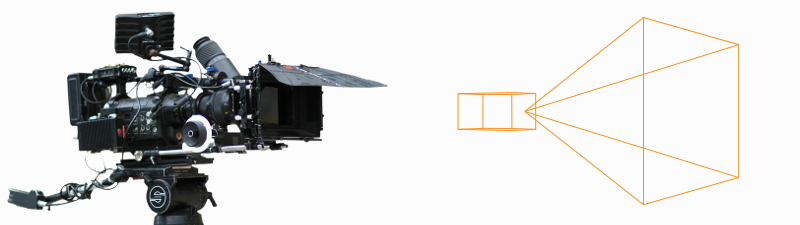

# Anatomy of a Camera #

> Tip :
> In this article, if a term is vital to describing cameras in Gaffer, its first occurence will be highlighted in **bold**.

The camera in Gaffer is designed to accommodate two related but sometimes divergent conceptions of a camera: the idealized "CG" cameras that we use in software, and the real cameras used in photography and cinematography.



Fundamentally, current mainstream renderers use the CG camera model. However, many users are well-versed in the operating principles of real cameras, in particular the properties of aperture and focal length. Some DCC and scene format developers have made an effort to integrate these properties into their projects, to make camera construction easier for this audience. Gaffer does the same.

Therefore, when using Gaffer, and in its scene data, a camera can be thought in terms of, and defined by, aperture and focal length. Cameras in Gaffer are also fully compatible with the Alembic and USD scene formats. Within a scene, a camera's properties are stored as special values known as **parameters**.


## Camera model ##


### Projection ###

By default, Gaffer supports cameras with either perspective or orthographic projection. Perspective projection can be thought of as a horizontal and a vertical field of view that form a viewing frustum. Orthographic projection can be thought of as collimating light to create parallel projection lines.

Three parameters determine camera projection:

- **projection**
- **aperture**
- **focalLength**

```{eval-rst}
.. figure:: images/illustrationPerspectiveOrthographic.png
    :scale: 100%
    :alt: Perspective and orthographic cameras in Gaffer

    **Figure 1.** The projection parameters of the two default camera types.
```

When the projection parameter is set to `perspective`, the angle of view can be controlled in the application by either the Field of View plug (as for a CG camera), or the Aperture and Focal Length plugs (as for a real camera). These latter two plugs replicate camera film back/sensor size, and lens focal length, respectively. When using these plugs, the user does not need to convert camera/lens projection into an angle, making it straightforward to replicate a real camera that was used in a shot. In the scene data, perspective is always stored as the aperture and focalLength parameters, even if the Field of View plug is used.

When the projection parameter is set to `orthographic`, the size of the orthographic view is controlled by the Orthographic Aperture plug. In this mode, the corresponding aperture parameter defines the width and height of the film back/sensor, in world space units.

Keep in mind that even though the scene describes projection with optical analogues, the result is still an approximation of a real camera. As with any CG camera, the implementation breaks with reality:

- With perspective projection, the aperture and focalLength parameters are dimensionless – numbers without units of measure. They are interoperable with values that define equivalent horizontal and vertical fields of view.
- As mentioned earlier, the term _aperture_ does not refer to an opening in a lens, but rather a rectangular region in 3D space that receives the image. It is, for practical purposes, equivalent to the film back/sensor. Since there is no lens, the image does not flip vertically before "hitting" this aperture.
- Other than focal length, lenses are not truly accounted for, except for when adding depth of field blur to the final image.


### Aperture offset ###

The **apertureOffset** parameter represents the amount by which the aperture is shifted parallel to the image plane.

```{eval-rst}
.. figure:: images/illustrationApertureOffset.png
    :scale: 100%
    :alt: Aperture offset in Gaffer

    **Figure 2.** The aperture offset parameters, applicable to either projection type.
```

The scale of the offset depends on the projection. With perspective projection, the offset is proportional to the field of view (when the Field of View plug is used) or to the camera's unit of measure (e.g. millimeter; when the Aperture and Focal Length plugs are used).


### Depth of field blur ###

Four parameters determine depth of field blur:
- **focalDistance**
- **fStop**
- **focalLengthWorldScale**
- focalLength

In order to simulate depth of field blur, the camera needs a virtual opening: a circle in 3D space on a plane perpendicular to the camera's direction. In effect, this is a **lens aperture**. From this circle, Gaffer calculates the angle of incidence of light coming from objects at a distance greater or less than the focalDistance. The larger the circle, the stronger the depth of field blur. The smaller the circle, the weaker.

```{eval-rst}
.. figure:: images/illustrationDepthOfField.png
    :scale: 100%
    :alt: Depth of field blur in Gaffer

    **Figure 3.** An approximation of depth of field blur in Gaffer.
```

> Important :
> The term _lens aperture_ has a meaning near to its real-world counterpart – it really can be thought of as a round opening in space.

The fStop and focalDistance parameters are identical to f-number and focus distance in real lenses. They allow easy replication of real lens settings.

The third parameter, focalLengthWorldScale, sets the scale between the camera's unit of measure and the world space's unit of measure. Because the circle occupies 3D space, the circle must be measured in world space units. Complicating things is the fact that the world space units might not be measured in millimeters. The scene could use any scale – centimeter, meter, foot, kilometer, etc. Therefore, the scale factor between them must be defined.

For depth of field, lens aperture is calculated with the formula:

```
lens aperture = (focalLength × focalLengthWorldScale) / fStop
```

For example, assume a lens with a focalLength of 50mm, an fStop of 4, and a world space measured in centimeters (default for Alembic/USD). First, we need to scale the focal length from mm to cm. Using a focalLengthWorldScale of 0.1 yields `50mm × 0.1 = 0.5cm`. This is the lens aperture at its widest. Dividing by the fStop of 4 results in the stopped-down lens aperture of `0.5cm / 4 = 0.125cm`.


## Cameras in the scene ##


### Camera data ###

Within the [scene paradigm](../../../AnatomyOfAScene/index.html#scene-hierarchy), a camera, just like any other scene component, starts with a location in the scene hierarchy. To define a camera, the location must have the following data:

- **Transform:** The vectors that define the position and orientation of the camera.
- **Object:** A special camera object at the location. Instead of geometry, the object stores camera data, called parameters.
    - **Parameters:** The crucial values that define a camera, such as the perspective type, field of view/aperture, and depth of field settings. If defined, a special kind of optional parameter, called a **render override**, will supercede one of the scene's **[render options](../../../AnatomyOfAScene/index.html#options)** during computation and rendering.<br>
    
- **Sets:** A list of sets the location belongs to. By default, every camera is assigned to an automatic "Cameras" set, accessible in the API by the `__cameras` variable.<br>
    


### Data flow ###

Like geometry, cameras are represented as objects at locations in the scene hierarchy. To actually look through a camera (either in a Viewer, or during a render), Gaffer needs additional information, such as the resolution and film fit. This information is provided in the scene globals as render options, and combined with the camera's data at the point of use. Below is a description of this data flow, with a demonstration of how a camera can optionally override these render options.

```{eval-rst}
.. figure:: images/illustrationCameraDataFlow.png
    :scale: 100%
    :alt: Camera data flow in a node graph

    **Figure 4.** The camera data flow through a node graph, with data passing between a Camera node, CameraTweaks node, and a StandardOptions node.
```

Each Camera node creates a camera, appearing in the scene hierarchy as its own location (by default called `/camera`). Each location will have its respective data. The locations and their data are passed to downstream scene nodes, like normal.

A downstream CameraTweaks node can add, remove, modify, or replace parameters of one or more cameras in the scene. Standard camera parameters can be removed: strictly speaking, there are no mandatory camera parameters, as Gaffer will supply fallback defaults. The addition of parameters with custom names and values is supported.

Camera and CameraTweaks nodes can add render overrides, which are a special kind of camera parameter. When a Viewer or a renderer looks through the camera, if a parameter has the same name as a render option, its value will take precedence over that option. An override can be added before its equivalent render option exists in the scene.

At a later point in the graph, a StandardOptions node selects the camera to use, and defines the scene's render options. If the camera has any render overrides, their values will supercede those of their equivalent render options.

Finally, all camera parameters and render options are passed to the renderer. All these data are used in combination by the renderer to calculate the image projection map, the image size, the motion blur, and the depth of field blur in the render.


## See also ##

- [Camera](../Camera/index.md)
- [Camera node reference](../../Reference/NodeReference/GafferScene/Camera.md)
- [Anatomy of a Scene](../AnatomyOfAScene/index.md)
