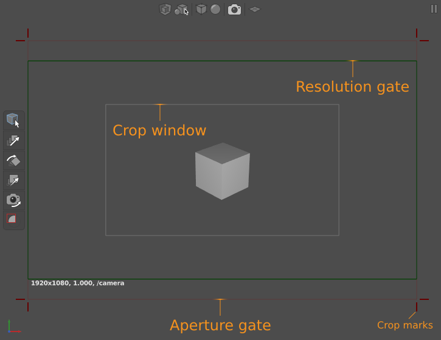
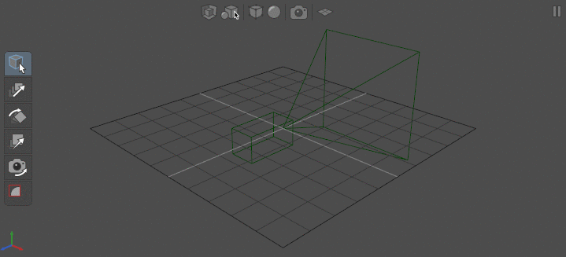
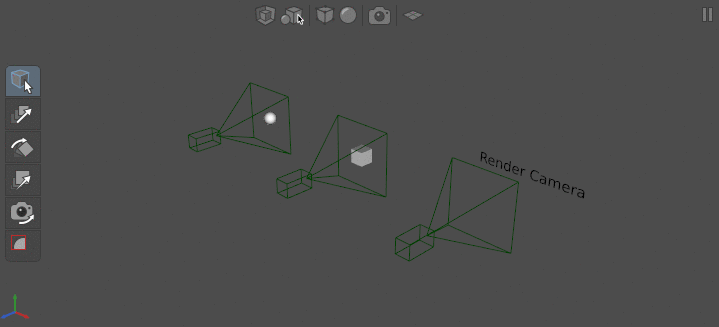
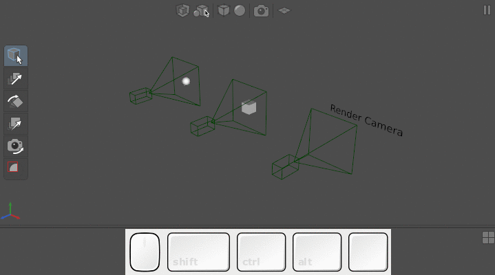
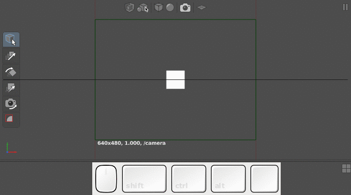
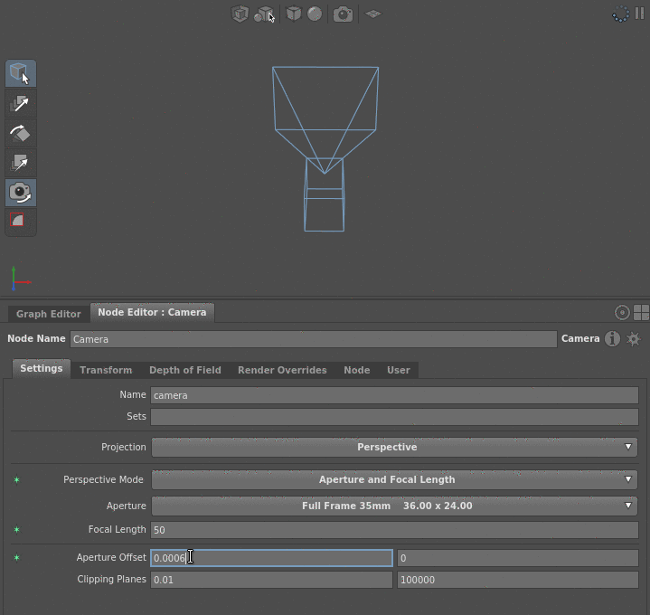
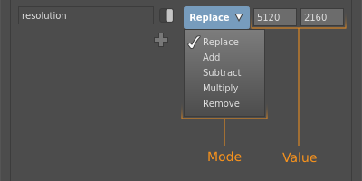

# Camera #

Gaffer's cameras setups are quite flexible, allowing for a variety of camera types, measurement systems, and industry-standard formats. With this freedom, you can simulate many common camera and lens setups.

In this article, we will assume you are fairly familiar with camera terminology and the settings of real cameras and lenses.

Before you begin, we highly recommend you read [Anatomy of a Camera](../AnatomyOfACamera/index.md).

## Camera basics ##

Each Camera node (_Scene_ > _Source_ > _Camera_) adds a scene containing a single location (`/camera` by default) with a camera object. When previewing the scene in the Viewer, the camera object is represented by a wireframe model. The width and size of the frustum on the model roughly corresponds to the angle of view and aspect ratio of the camera.

Scenes can support multiple cameras, but renderers typically work with one at a time. The StandardOptions node, placed downstream, sets which camera in the scene to use for a given render.

When looking through a camera, the Viewer matches its projection, so the scene will appear as foreshortened or as flat as dictated by the projection parameters. This lets you preview the precise framing and composition of the scene. Additionally, a frame overlay appears in the Viewer, showing the aperture gate, the resolution gate, and the crop window.

> Tip :
> If the aperture gate isn't visible, that means it is identical to the resolution gate.

## Instructions ##

### Manipulating a camera ###

#### Selecting, translating, and rotating a camera ####

Like other objects in the scene, the camera can be manipulated in the Viewer. You can select it by clicking it or dragging a marquee around it, rotate it with the Rotate Tool  (<kbd>W</kbd>), and translate it with the Translate Tool  (<kbd>E</kbd>).

#### Selecting a look-through camera for a Viewer ####

Each Viewer can be set to look through a camera in the scene, rather than the default free camera. This can be quite useful if the scene has multiple cameras and you need to preview each in a separate Viewer at once, such as in a scene with witness cameras, or if you simply want to compare the flat-shaded scene to its render preview.

To select a look-through camera for a Viewer:

1. In the Viewer, click . A drop-down menu of objects will appear.
2. Select either _Render Camera_ for the current scene's render camera (if defined by a StandardOptions node), or a camera from the _Camera_ sub-menu (a list of all cameras in the current scene).

#### Translating and rotating the look-through camera ####

With the Camera Tool  toggled on, you can translate and rotate the look-through camera with the [camera controls](../../../../Interface/ControlsAndShortcuts/index.html#d-scenes).

> Note :
> The shortcuts for the clipping plane affect the clipping plane of the default free camera, **not** the look-through camera.

#### Orbiting with the look-through camera ####

Like the default free camera, you can set the look-through camera to focus on an object in the scene, and orbit it around that object's position.

To orbit with the look-through camera:

1. Make sure the Camera Tool  (<kbd>T</kbd>) is activated.
2. Select an object in the scene.
3. Hit <kbd>F</kbd>. The camera will aim at the object and adjust position.
4. Use the [camera controls](../../../../Interface/ControlsAndShortcuts/index.html#d-scenes) to orbit around the object.

### Constructing a perspective camera ###

When constructing a camera with perspective projection, there are two projection modes available: _Field Of View_, and _Aperture and Focal Length_. With _Field Of View_, you can provide an angle of view, like with a typical CG camera. With _Aperture and Focal Length_, you can replicate the real projection settings of a camera/lens setup by inputting its actual aperture and focal length settings.

To construct a perspective camera:

1. Create a Camera node (_Scene_ > _Source_ > _Camera_).
2. In the Node Editor, set the Projection plug to _Perspective_.

Then, assign the projection parameters using one of the perspective modes:

#### Using field of view ####

1. Set the Perspective Mode plug to _Field Of View_.
2. Input an angle for the Field Of View plug, in degrees.
3. For the Aperture Aspect Ratio plug, input an appropriate horizontal-to-vertical ratio for the image. For example, a 16:9 frame would be `1.778`.

#### Using aperture and focal length ####

1. Set the Perspective Mode plug to _Aperture and Focal Length_.
2. For the Aperture plug, select the appropriate camera from the list of standard camera film backs/sensors. If the camera you need is not available:
    1. Select _Custom_. Two new plug fields will appear. Fill in:
        
        - aperture.x: The horizontal film back/sensor length, typically in millimeters.
        - aperture.y: The vertical film back/sensor length, typically in millimeters.
    2. Set the Focal Length plug to an appropriate lens focal length. This is typically in millimeters.

> Important :
> You can set the Aperture and Focal Length plugs as numbers in any unit of measure (millimeter, centimeter, inch, etc.), so long as they use the **same** unit of measure, and the lengths are proportional to each other. For example, if the film back is in millimeters, then the focal length should also be in millimeters.

### Offsetting a camera ###

The offset is the amount by which the camera view is shifted parallel to the image plane. This parameter is used in special cases, such as simulating a tilt-shift lens, rendering tiles for a panorama, or matching a plate that has been asymmetrically cropped.

A camera's Aperture Offset plug controls the horizontal and vertical offset. The length of one unit of offset depends on the projection type of the camera:
- Perspective projection:
    - _Field Of View_ mode: 1 offset = 1 whole horizontal field of view (for example, 45°).
    - _Aperture and Focal Length_ mode: 1 offset = 1 aperture unit of measure (for example, 1 millimeter).
- Orthographic projection: 1 offset = 1 world space unit.

### Adding depth of field blur ###

Depth of field is controlled as if the camera had a lens, with plugs analogous to real lens settings – F Stop and Focus Distance plugs. You can use these settings to replicate the depth of field of a real lens.

> Tip :
> If you need to preview depth of field blur, render the scene through an interactive renderer.

To add depth of field blur:

1. Select the Camera node in the Graph Editor.
2. In the Node Editor, switch to the _Depth of Field_ tab.
3. Input an appropriate F Stop plug value for the lens aperture. The higher the number, the less depth of field blur.
4. Select a Focal Length World Scale plug value. This is the scale factor between the camera's focal length unit of measure and the world space unit of measure. For example, if the focal length is measured in millimeters but the world is measured in centimeters, select _Millimeters to Centimeters (0.1)_. For most scenes and scene formats, use this scale. If the scale you need isn't provided, select _Custom_ and input a custom scale.
5. Input the Focus Distance plug value between the camera and the object(s) in focus, in world space units.
    
6. On a downstream StandardOptions node, enable the Depth Of Field plug (click ) and turn it on.
    

> Important :
> Depth of field information will only be passed to the renderer if the Camera node's F Stop plug is greater than `0` and a downstream StandardOptions node has its Depth of Field Blur plug enabled and turned on. Otherwise, your render will not have depth of field blur.

## Render overrides and camera tweaks ##

Depending on your workflow and pipeline process, and how upstream data is inherited by your graph (such as from Reference nodes), you may find yourself in situations where you need to:

- Introduce a camera that, to work correctly, must override one or more of the scene's [render options](../../../AnatomyOfAScene/index.html#options) (such as the film fit), preempting the downstream StandardOptions node.
- Override an upstream camera's parameters, or preempt the downstream render options, without modifying the associated nodes.
- Completely override a camera to create a custom camera type.

You can resolve these by enabling the Camera node's render overrides, employing a CameraTweaks node, or a combination of both.

### Render overrides ###

A **render override** is a special camera parameter that overrides a corresponding render option.

Since an override is a parameter, and thus data on the camera's object, it does not modify the actual render option. It instead takes precedence over the render option during computation or rendering. An override can be tweaked or removed at a later point in the graph. If removed, the corresponding render option will come into effect again.

To activate a render override:

1. Select a Camera node in the Graph Editor.
2. In the Node Editor, switch to the _Render Overrides_ tab.
3. Enable the override (click ) and adjust its plug values as needed.

### Camera tweaks ###

The CameraTweaks node (_Scene_ > _Object_ > _Camera Tweaks_) is a special node that adds any number of adjustments, known as as **camera tweaks**, to render options and camera parameters. A camera tweak can also add custom camera parameters to the scene data.

Multiple tweaks can be applied to the same parameter or render option. If so, they apply their operations in sequence.

Every tweak from the CameraTweaks node is applied to every camera specified by the node's filter.

To add a camera tweak:

1. Create a CameraTweaks node at a point in the graph that is downstream of the target camera(s).
2. Create a PathFilter node, add the path location(s) of the camera(s) to it, and connect it to the filter plug of the CameraTweaks node.
3. Select the CameraTweaks node.
4. In the Node Editor, click  and select a parameter or render option to tweak. The tweak will appear in the editor as a compound plug.
5. Enable the tweak (click ).
6. Assign the tweak operation: 
    
    - Mode: The operation to apply between the new value and old value of the parameter or render option. You have a choice between _Replace_, _Add_, _Multiply_, and _Remove_. String values cannot be multiplied/added/subtracted. For example, with default parameter value `A`, operation _Multiply_, and new value `B`, the tweak would apply `A × B`.
    - Value: The new value to use in the operation.

## Example graphs ##

### Anamorphic camera setup ###

This can be loaded in Gaffer from _Help_ > _Examples_ > _Rendering_ > _Anamorphic Cameras_.

A setup that replicates an anamorphic camera and lens, by rendering with a non-square pixel aspect ratio.

### Spherical camera in Arnold ###

This can be loaded in Gaffer from _Help_ > _Examples_ > _Rendering_ > _Spherical Cameras (Arnold)_.

A camera with spherical projection that is compatible with the Arnold renderer. To achieve this, a CameraTweaks node overrides certain camera parameters to create a custom projection type. The tweaks are:

> Tip :
> Other renderers will likely use similar means to achieve spherical cameras.

> Note :
> Due to a bug, when rendering a spherical camera for Arnold, the `filmFit` tweak must be set to _Horizontal_, not _Distort_.

## See also ##

- [Anatomy of a Camera](../AnatomyOfACamera/index.md)
- [Camera Node Reference](../../Reference/NodeReference/GafferScene/Camera.md)
- [CameraTweaks Node Reference](../../Reference/NodeReference/GafferScene/CameraTweaks.md)
