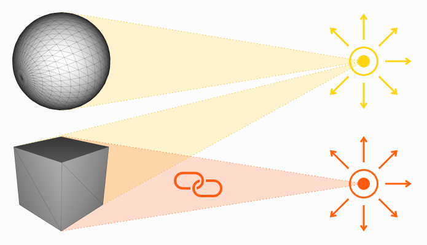
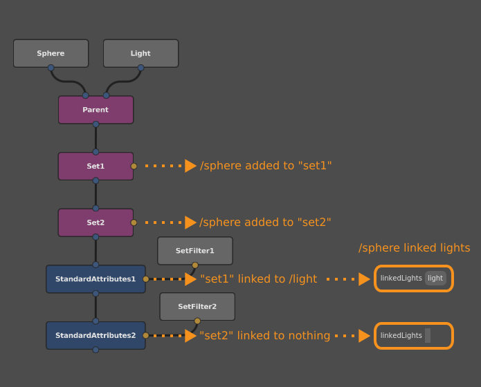
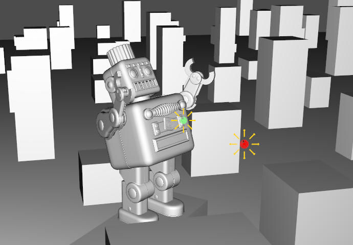
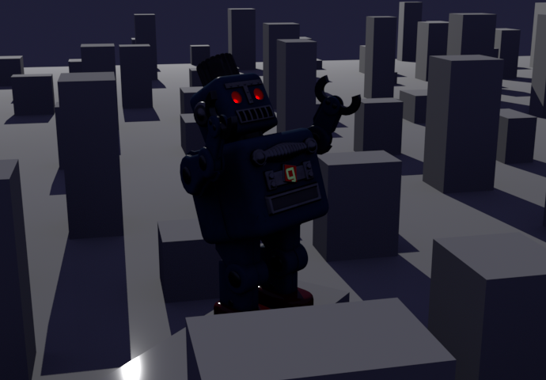
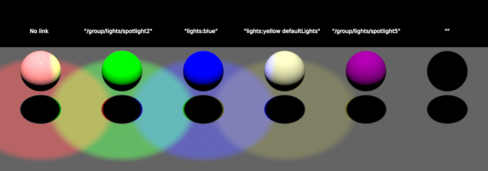
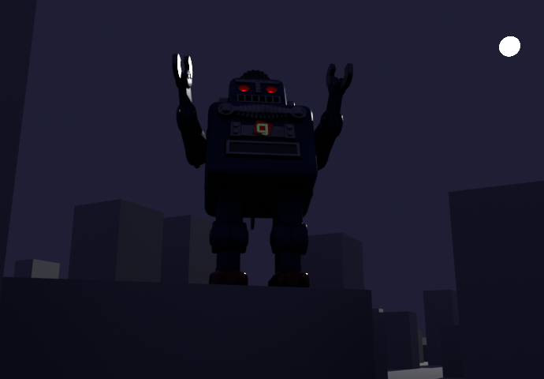

# Light Linking #

When lighting a scene, you will sometimes need to selectively control whether a piece of geometry is illuminated by a particular light, both for artistic purposes and to cut down on rendering time. The relationships that determine whether a light applies to an object are collectively known as **light linking**, and are controlled by the object's `linkedLights` attribute.



> Note :
> The only supported renderer that currently implements light linking is Arnold.

> Tip :
> Maya users will be familiar with the concept of light-centric (light-to-object) and object-centric (object-to-light) light linking. The procedure for linking lights in Gaffer is similar to object-centric linking.


## Mechanics of light linking ##

From the light side of things, by default, each light is a member of a set named **"defaultLights"**, and will cast light on every object in the scene. Each light's node has a Default Light plug, which is checked by default. If unchecked, the light is removed from "defaultLights", and, from then on, will only illuminate objects that are expressly linked to it.


From the object side of things, by default, an object is lit by all lights belonging to the "defaultLights" set. To bring about any other behaviour, such as having the object only lit by one light, a `linkedLights` attribute must be added to the object's location in the hierarchy, and the attribute must specify one or more lights, or sets of lights. The `linkedLights` attribute follows standard [inheritance rules for attributes](../../../AnatomyOfAScene/index.html#attributes) in the hierarchy, so if the object doesn't have the `linkedLights` attribute, but one of its ancestors does, it will inherit the attribute.

```{eval-rst}
.. figure:: images/interfaceLinkedLightsAttribute.png
    :scale: 100%
    :alt: The linkedLights attribute of an object as it appears in the Scene Inspector.

    The linkedLights attribute of an object, as it appears in the Scene Inspector.
```


## Instructions ##

In a graph, in order to actually link a light to an object, you must connect a StandardAttributes node downstream of the object, filter for the object's location, and then add a set expression to the Linked Lights plug.


Once the Linked Lights plug is toggled on, the `linkedLights` attribute is added to the object's location. The value of the Linked Lights plug is a [set expression](../../Reference/ScriptingReference/SetExpressions/index.md), which can consist of individual light locations, set names, or both. We will cover how to filter for both types below.

> Important :
> The Linked Lights plug is an exclusive list. If you toggle the plug and leave the list blank, the object will not be illuminated by any lights **at all**.
> In order to link a particular light **in addition to** all default lights to an object, you must include `defaultLights` in the set expression, for example `defaultLights /group/light`.


### Linking by location ###

To link a light by location, simply add the light's full location to the set expression. No additional node is needed.


> Important :
> When linking a light by its location, the path you provide **must** be the final location of the light within the hierarchy **as delivered to the render node**. For example, if you link to a light at `/group/light`, but later in the graph you shuffle the hierarchy and the light exists at `/building/lights/light`, the renderer will look for the light at the original location, find nothing there, and then the link will fail. Therefore, you would unintuitively need to target a downstream location in an upstream part of the graph.


### Linking by set ###

In setups with more than a few lights, managing a set expression with multiple light locations is prone to user error, and tedious to maintain. That's why it's usually better to link objects to one or more sets containing lights, as the term _set expression_ suggests. Put another way, you can perform **set**-centric light linking. The end result would still be the same, in that specific objects are linked to specific lights.

A light can be added to any number of custom sets using the Sets plug on the light's node, or a separate Set node. Custom sets are separate and do not affect the "defaultLights" set.


To link one or more lights by a set, simply add it to the set expression.


Be aware that if an object belongs to multiple sets with light linking, the object will only inherit the `linkedLights` attribute from the last set that was linked in the graph, as shown in the illustration below.




## Example scenario ##

Here we'll explore an example scenario where link lighting would be appropriate, and then propose a way to set it up.


### An artistically-lit scene ###

Picture a scene where a giant robot attacks a highly detailed metropolitan city at night. For dramatic effect, let's say we want the robot's eyes to shine with some menacing red highlights. What's more, on the robot's chest is affixed the logo of its evil creator, and we want to make sure the audience can just make out the logo, regardless of the ambient illumination. With a photorealism mindset, both of these lights would be conceits, as they would have no plausible light source. Even so, with their inclusion, the scene becomes more evocative.



To achieve both of these highlights, we could add special lights in front of the robot's eyes and chest. But, by default, these lights would also illuminate the rest of the robot, and everything else in the scene. This may not achieve our artistic intent, and could also affect render time and memory usage.


### Light linking solution ###

Let's consider a possible light link setup for this scene, with the goal of achieving our artistic intent while reducing the impact of the special lights on render time and memory.


### Lights ###

Location     | Default Light plug value  | Special light sets
-------------|---------------------------|-------------------
/lights/sky  | `True`                    |
/lights/moon | `True`                    |
/lights/eyes | `False`                   | "lights:eyes"
/lights/logo | `False`                   | "lights:logo"


### Objects ###

Location                                 | `Linked Lights` expression
-----------------------------------------|---------------------------
/assets/...                              | -
/assets/GAFFERBOT/[etc]/L_eyeLens001_REN | `defaultLights lights:eyes`
/assets/GAFFERBOT/[etc]/R_eyeLens001_REN | `defaultLights lights:eyes`
/assets/GAFFERBOT/[etc]/C_torso009_REN   | `defaultLights lights:logo`


### Results ###

The above set expressions link the special lights and sets. The eyes are linked to all lights plus the eye light's set; the logo is linked to all lights plus the logo light's set. The result is that the special lights only illuminate the subjects we want them to: the eye light hits the eyes, and the logo light hits the logo.



Set name        | Set members
----------------|------------
"defaultLights" | /lights/sky /lights/moon
"lights:eyes"   | /lights/eyes
"lights:logo"   | /lights/logo

Object                                   |Linked lights
-----------------------------------------|---------------
/assets/...                              | –
/assets/GAFFERBOT/[etc]/L_eyeLens001_REN | /lights/sky /lights/moon /lights/eyes
/assets/GAFFERBOT/[etc]/R_eyeLens001_REN | /lights/sky /lights/moon /lights/eye
/assets/GAFFERBOT/[etc]/C_torso009_REN   | /lights/sky /lights/moon /lights/logo


## Example graphs ##

### Light linking basics ###

> _Help_ > _Examples_ > _Lighting_ > _Light Linking Basics (Arnold)_



This example contains the various permutations of light linking on objects:

1. No link (default)
2. Link to a light's location
3. Link to a set containing a light
4. Link to a set and the "defaultLights" set
5. Link to a non-default light
6. Link to a blank expression


### Light linking city attack ###

> _Help_ > _Examples_ > _Lighting_ > _Light Linking City Attack (Arnold)_



In this example, a supersized version of our mascot, Gaffy, is throwing a tantrum, and attacking a city. Two special and unrealistic light sources are added to the scene, in order to add highlights to  Gaffy's eyes and chest logo. This graph contains the light-link setup described in the above example scenario.


## See also ##

- [Set Expressions Reference](../../Reference/ScriptingReference/SetExpressions/index.md)
