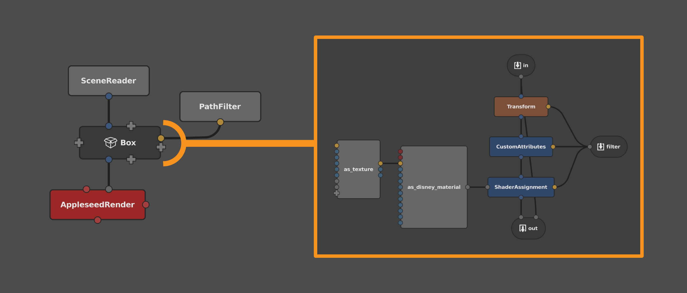
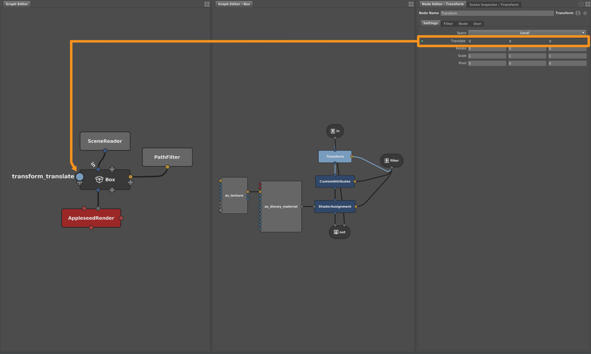

# Box Node #

A Box node (_Utility_ > _Box_) is a container for holding a nested node network inside a node graph. The network contained by a Box is called a **sub-graph**. A sub-graph can only be viewed if you enter its containing Box. You can use Boxes to organize and add modularity to your node graphs.

## Usage ##

Boxes are powerful tools for structuring, organizing, and abstracting node graphs. They are the primary structure that adds modular capabilities to your graphs, and can form the backbone of multi-user, multi-stage pipelines. With Boxes, you can author discrete graphs with custom UI and documentation, enabling you to share methods, processes, workflows, and tricks across your facility or work group without needing to code new modules.

In their most basic uses, you can simplify large graphs by wrapping up complicated portions in Boxes, or sub-divide a graph into a series of component sub-graphs.

You can also nest Boxes, to maintain modularity and simplicity in your sub-graphs.

In more advanced uses, Boxes serve to export (and occasionally import) saved sub-graphs, known as **reference scripts**. When you export a Box, it preserves any custom UI, descriptions, tooltips, and documentation links in the network and on the Box itself, giving you the ability to document the network's purpose and function for other users.

## Box data flow ##

Like any other node, a Box can have _in_ and _out_ plugs. It can take plugs from the main graph, make their data available to the sub-graph, and then output them back into the main graph. 

### BoxIn and BoxOut nodes ###

While you can connect the nodes inside a Box to the main graph, you cannot view both the main graph and a sub-graph in the same _Graph Editor_. To compensate, a sub-graph's main input and output connections are represented by the special **BoxIn** (_Utility_ > _BoxIn_) and **BoxOut** (_Utility_ > _BoxOut_) nodes. When a Box has _in_ or _out_ plugs, these nodes behave as proxies for them in the sub-graph. The names of the BoxIn and BoxOut nodes will match the names of their corresponding plugs on the Box, and vice versa.

### Promoted plugs ###

When boxing up portions of your node graph, the _in_ plugs of the top-most node(s) and _out_ plugs of the bottom-most node(s) are promoted up to the Box. These **promoted plugs** pass data between the main graph and the sub-graph. This is not limited to main _in_ and _out_ plugs: any plug in the sub-graph can be promoted to the Box.

In the sub-graph, promoted plugs are read-only (they appear greyed out in the _Node Editor_). They can only be edited on the Box in the main graph. 

## Instructions ##

The following instructions cover the fundamental component actions you can perform with Boxes. You can combine these actions to set up Boxes in an almost limitless number of configurations and arrangements.

### Boxing up nodes ###

The most basic action you can perform with a Box is to select a bunch of nodes and wrap them up in a new Box.
To box up a bunch of nodes:

1. Select one or more nodes in the _Graph Editor_.
2. Create a Box (_Utility_ > _Box_).

The selected nodes will be replaced by a Box. If they were connected to other nodes in the main graph, the Box and the sub-graph will automatically populate with corresponding _in_ and _out_ plugs to maintain the connections.

### Entering and exiting a Box ###

The _Graph Editors_ can only view the main graph or a sub-graph at a time. To navigate between them, you must enter or exit the Box, or open a new _Graph Editor_.

#### Entering ####

To enter a Box:

1. Select the Box.
2. Hover the cursor over the _Graph Editor_, then hit <kbd>↓</kbd>.

#### Entering through a new _Graph Editor_ ####

To enter a Box through a new _Graph Editor_:

- Right-click the Box, then select _Show Contents..._ from the context menu. The new _Graph Editor_ will appear in a tab on the same panel as the first _Graph Editor_.

#### Exiting ####

To exit a Box:

- Hover the cursor over the _Graph Editor_, then hit <kbd>↑</kbd>.

### Connecting a Box to the main graph ###
You can connect the main graph to the sub-graph by adding _in_ and _out_ plugs to the Box. There are two main methods to accomplish this.

The simplest way to connect a Box to a main graph is to promote a node's main _in_ or _out_ plug:

1. Enter the Box.
2. Right-click an _in_ or _out_ plug on a node in the sub-graph, then select _Promote to Box_. The plug will become available on the Box in the main graph.
    - If the plug is an _in_ array plug, such as the input of a Group node, you can instead select _Promote Array to Box_.
3. Exit the Box, and connect the new plug to a node in the main graph.

Alternatively, dragging a connection to a  on the Box creates a corresponding BoxIn or BoxOut node in the sub-graph:

### Setting up a Box for pass-through ###

By default, you cannot disable a Box. If it has _in_ and _out_ plugs set up, you also cannot automatically interject it by dropping it over a connection. The BoxOut node has a special _passThrough_ plug, which, when connected to a BoxIn node, provides data pass-through, which enables dropping onto connections and disabling.

> Important :
> The BoxIn node and its connected BoxOut node with the _passThrough_ plug become the main plugs that connect when you drag and drop the Box over a connection.

To set up a Box for disabling and pass-through:

1. Enter the Box.
2. Connect the _passThrough_ plug to a BoxIn node.

### Promoting and demoting a plug ###

Any plug in the sub-graph can be promoted to the Box. If the plug is not the main _in_ or _out_ plug of the node, it will become available for editing on the Box node. If you no longer need a plug on a Box, you can demote (remove) it from the Box.

#### Promoting a plug ####

To promote a plug to a Box:

1. In the sub-graph, select the node.
2. In the _Node Editor_:
    - Single element plug: right-click the plug **value**, then select _Promote to Box_ from the context menu.
    - Multi-element plug: right-click the plug **name**, then select _Promote to Box_ from the context menu.
    - Compound plug: right-click the plug **name**, then select _Promote <compound plug> to Box_ .
    The plug will become locked.

When promoted, the following plug types will also add a plug to the Box in the _Graph Editor:_

- Floating-point number
- Multi-element plug
- Compound plug

Once promoted, you can set the name and value of the plug on the Box using the _Node Editor_. If the promotion added a plug to the Box in the _Graph Editor_, you can drive its value by connecting it to a node.

#### Demoting a plug ####

Promoted plugs can be demoted (removed) from the Box, either on source node in the sub-graph, or on the Box itself.

> Note :
> Demoting a plug does not delete it from the sub-graph.

To demote a plug:

1. Enter the Box.
2. Select the node with the promoted plug.
3. In the _Node Editor_, right-click the plug label, then select _Unpromote from Box_ from the context menu.

> Tip :
> For faster results, you can unpromote a plug on the Box itself by first right-clicking the plug label in the _Node Editor_, then selecting _Delete_ or _Unpromote from Box_ from the context menu.

### Editing the UI of a Box ###

#### Adjusting plug position ####

Like other utility nodes with addable plugs, you can reposition and rearrange the plugs on a Box. You can move a plug to any edge of the Box in the _Graph Editor_, or adjust the order of the plugs on an edge.

> Note :
> An addable plug () cannot be moved or re-ordered. You must connect or promote a plug to it first.

To adjust the position of a plug on a node, first right-click the plug in the _Graph Editor_. The context menu will open. Then:

- Move the plug to a different node edge:
    - Select _Move To_, then select _Top_/_Bottom_, or _Left_/_Right_.
- Re-order plugs on a node edge:
    - Select _Move Up_/_Move Down_, or _Move Left_/_Move Right_.

#### Renaming and relabelling plugs ####

You can **rename** and **relabel** any plug on a Box in the _Graph Editor_, including a main _in_ or _out_ plug, to clarify its function.

Plug names differ from plug labels. A plug's name is its actual name when referenced in the node graph, and will appear when you hover over the plug in the _Graph Editor_; its label is how it appears in the _Node Editor_. Renaming a plug in the _Graph Editor_ changes its name, while renaming a plug in the _Node Editor_ actually changes its label.

To **rename** a plug:

1. In the _Graph Editor_, right click the plug, then select _Rename..._ from the context menu. A renaming dialogue will open.
2. Type a new name, then click _Rename_.

> Tip :
> Since BoxIn and BoxOut nodes behave as proxies for the main _in_ and _out_ plugs, you can modify their node names to rename the corresponding plugs on the Box.

To **relabel** a plug:

1. Select the node with the plug.
2. In the _Node Editor_, double-click the plug label, 
3. Type a new label.

#### Metadata and appearance ####

The metadata plugs of a Box, which comprise its name, description, documentation URL, and color, can be edited to better describe and provide support information for it. These plugs are preserved when the Box is exported as a reference script, so their values are crucial for authoring custom Reference nodes.

- Name: The node's name. Same as the name plug.
- Description: Text that appears in the tooltip and the _Node Editor_. Can be adjusted to explain the Box's purpose, contents, and connections.
    > Tip :
    > You can format the _Description_ plug using [Markdown](https://commonmark.org) syntax.
- Documentation URL: The main help link for the Box (visited by clicking  in the _Node Editor_). Can be edited to point to a location with custom documentation on your studio filesystem or the internet.
- Color: Determines the color of the Box in the _Graph Editor_.

To edit the metadata and appearance of a Box:

1. Select the Box.
2. In the _Node Editor_, click , then select _Edit UI..._. The _UI Editor_ will open.
3. Edit the _Name_, _Description_, _Documentation URL_, and _Color_ values as needed.

### Exporting and importing a reference script ###

A Box, its sub-graph, its promoted plugs, and its metadata can all be exported as a single reference script. A Box can also import a reference script, which will **add** (not replace) the contents of the script to its sub-graph.

> Tip :
> Unlike the Reference node, when you load a reference script into a Box, its contents are writeable, meaning you can edit the sub-graph of the reference.

To export a Box as a reference script, or import a reference script into a Box:

1. Select the Box.
2. In the _Node Editor_, click .
3. Select _Export Reference_ or _Import Reference_. A file dialogue will open.
4. Using the file dialogue, export or import a `.grf` file.

## Demos ##

### Box basics ###

This can be loaded in Gaffer from _Help_ > _Examples_ > _Box Basics_.

A very simple Box with _in_ and _out_ plugs, promoted plugs, and custom UI.

## Limitations ##

### Attribute history focus ###

If you use the attribute history to find a node, and the node is inside a Box, the _Graph Editor_ will focus on the whole node graph, rather than the Box.

### Dragging scene locations ###

When a Box has a promoted filter plug, you cannot drag a scene location from the _Hierarchy View_ onto the Box to automatically add and connect a Path Filter node.
