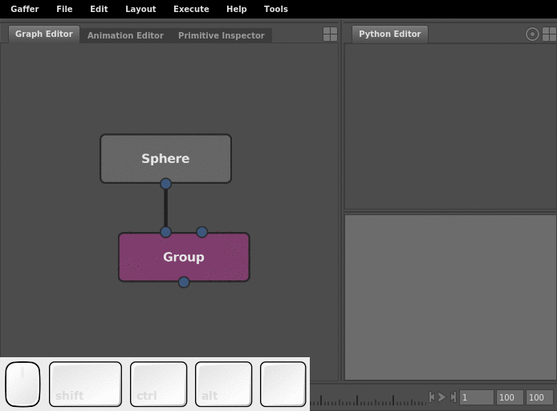

---
substitutions :
  nodes : ""
  plug : ""
  values : ""
  objects : ""
  editorFocusMenu : ""
---

# The Python Editor #

The Python Editor is a type of editor in the main Gaffer application that can execute arbitrary Python code with a built-in interpreter. It enables you to modify the node graph, try commands and syntax, and inspect data. In the default layout, it resides in the bottom-right panel, in a tab next to the Hierarchy View.

Each Python Editor is a separate instance. Python modules that you `import` will remain loaded in that particular editor for its lifetime. However, you never need to `import` the [Gaffer](../../Reference/NodeReference/Gaffer/index.md) or IECore modules. They are loaded by default.

The Python Editor is split into two areas. The bottom-half is the input field. The top-half is the output. The input field of the Python Editor functions like a basic plain text editor. You can type, select, cut, copy, paste, and execute code.

The output field behaves like a typical console output. It records the output stream, including return values and errors. Errors appear in red.

> Caution :
> Code in Expression nodes is handled by a separate interpreter, and the syntax between them and the Python Editor should not be considered safely compatible.

## Instructions ##

### Executing code ###

Executing code will erase the input field, just like in a debug console. However, if you highlight any part of the code, only that part will execute, and the whole input will be preserved.

To execute code with the Python Editor:

1. Enter code into the input field.
2. Hit <kbd>Ctrl</kbd> + <kbd>Enter</kbd>.

> Tip :
> A useful debugging trick is to highlight any part of the input code in order to preserve the whole input for reuse.

### Accessing elements and data from other editors ###

The Python Editor can access the same graph elements (nodes and plugs) and scene and image data results (locations, objects, and so on) visible in the various other editors. However, this requires inputting precise dictionary syntax, data types, and code. Instead of typing out the exact code, you can use a shortcut: simply click and drag the element or data from the editor into the Python Editor's input field.

The specific shortcut for dragging depends on the source editor:

Element                | Source editor   | Shortcut              | Cursor      | Example code result
-----------------------|-----------------|-----------------------|-------------|--------------------
Node(s)                | Graph Editor    | Middle-click and drag | {{nodes}}   | `root['Sphere']`
Plug                   | Node Editor     | Click and drag        | {{plug}}    | `root['Sphere']['radius']`
Plug value             | Node Editor     | Middle-click and drag | {{values}}  | `2.7`
Object(s)              | Viewer          | Click and drag        | {{objects}} | `['/sphere']`
Scene location(s)      | Hierarchy View  | Click and drag        | {{objects}} | `['/sphere']`
Scene data             | Scene Inspector | Click and drag        | {{values}}  | `V3f(1.5, 2.7, 3.9)`

> Note :
> When pulling scene data, remember to consider the evaluated node's effect on the scene hierarchy, because an object's location in the hierarchy can vary from node to node. For example, if a Group node puts a sphere in `/group/sphere`, but you query the Group node using the original `/sphere` path, you will have queried a location that no longer exists, as far as that node is concerned.

## See also ##

- [Tutorial: Node Graph Editing in Python](../TutorialNodeGraphEditingInPython/index.md)
- [Tutorial: Querying a Scene](../TutorialQueryingAScene/index.md)
- [Scripting Reference](../../Reference/ScriptingReference/index.md)
- [Controls and Shortcuts](../../Interface/ControlsAndShortcuts/index.md)
